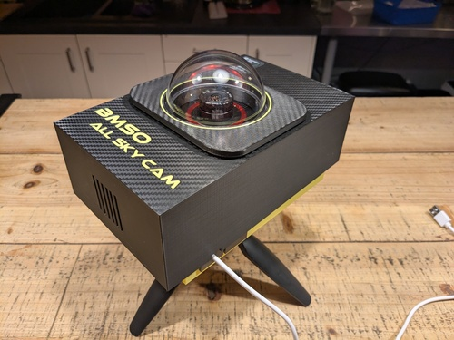
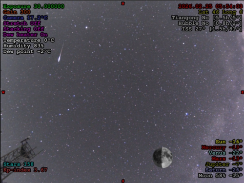

# BMSO All sky DIY camera

  

## Introduction
BMSO is the name of my personnal mobile observatory. I wanted a small portable "all-sky" camera to put on the roof of my van during the nights I spend astrophotographing the dark skies. The goal is to monitor the sky and environmental data (humidity/temperature/dew point, clouds, comming rain,...) and by the way make some nice timelapses of the rotating sky. Such a camera is generally expensive and not very easy to use as a mobile device. So, here's my own DIY all-sky camera. I's build around a [ZWO ASI 224MC](https://www.zwoastro.com/product/zwo-asi224mc/), but you can use any other [Indi](https://indilib.org/) supported device. The advantage of this 224MC model is that it already comes with a small wide angle objective that you can directly use in this setup, and it's relatively inexpensive. I found mine as a second hand for 150 €.

The case of the camera is made with a 3D printer in PETG and the "brain" is a [Raspberry-Pi 5](https://www.raspberrypi.com/products/raspberry-pi-5/) with 4GB of RAM, but it should work with a less expensive model RP-4.

The software stack is fully opensource: (Raspbery Pi OS)[https://www.raspberrypi.com/software/operating-systems/] (Linux Debian based) with [Indi](https://indilib.org/) and the excellent [Indi allsky](https://github.com/aaronwmorris/indi-allsky) project.

The whole thing may cost you less than 300 €

