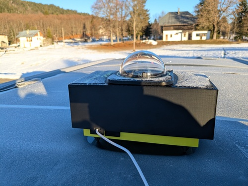
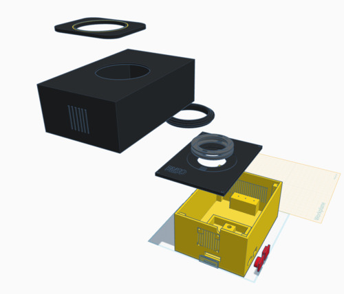
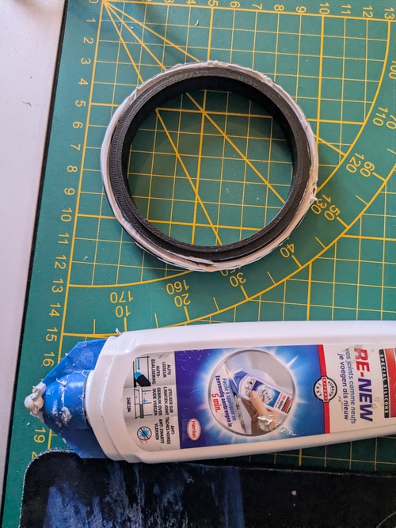
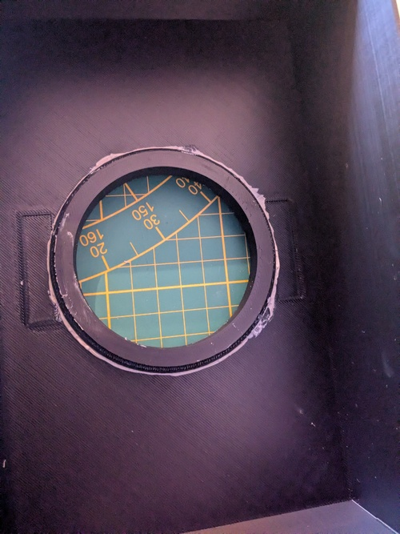
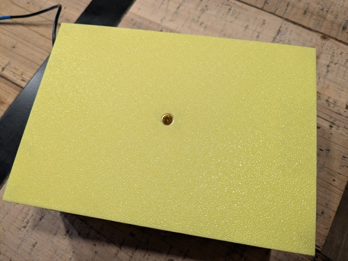
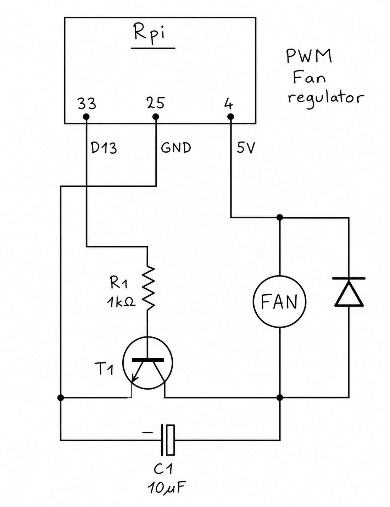
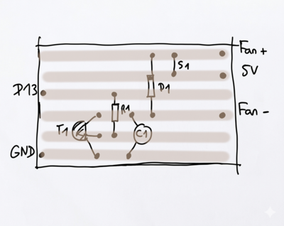

# BMSO All sky DIY camera

  

## Introduction
BMSO is the name of my personnal mobile observatory. I wanted a small portable "all-sky" camera to put on the roof of my van during the nights I spend astrophotographing the dark skies. The goal is to monitor the sky and environmental data (humidity/temperature/dew point, clouds, comming rain,...) and by the way make some nice timelapses of the rotating sky. Such a camera is generally expensive and not very easy to use as a mobile device. So, here's my own DIY all-sky camera. I's build around a [ZWO ASI 224MC](https://www.zwoastro.com/product/zwo-asi224mc/), but you can use any other [Indi](https://indilib.org/) supported device. The advantage of this 224MC model is that it already comes with a small wide angle objective that you can directly use in this setup, and it's relatively inexpensive. I found mine as a second hand for 150 €.

The case of the camera is made with a 3D printer in PETG and the "brain" is a [Raspberry-Pi 5](https://www.raspberrypi.com/products/raspberry-pi-5/) with 2 GB of RAM, but it should work with a less expensive model RP-4.

The software stack is fully opensource: [Raspbery Pi OS](https://www.raspberrypi.com/software/operating-systems/) (Linux Debian based) with [Indi](https://indilib.org/) and the excellent [Indi allsky](https://github.com/aaronwmorris/indi-allsky) project.

The whole thing may cost you less than 200 €

The power supply is a simple USB cable. I use a 27000 mAh USB power tank and it easily runs a full 12 hours night by 0°C.

 

You can check some sample timelapses [here](sample_timelapses/)

## List of supplies

- [ZWO ASI 224MC](https://www.zwoastro.com/product/zwo-asi224mc/) camera or any [Indi](https://drivers.indilib.org/cameras/) compatible device. As any astronomy camera, the more sensible the best. Avoid too small sensors as it will reduce the field of view.
- A wide angle CS-mount Lens, if your camera does not already have one. This one should be better than the one in the box of the 224MC which is only 150 degrees : [ZWO CCTV Lens 2.5 mm 170 Degrees - for ASI cameras without cooling](https://www.teleskop-express.de/en/astrophotography-and-photography-15/other-photo-accessories-143/zwo-cctv-lens-2-5-mm-170-degrees-for-asi-cameras-without-cooling-10246)
- A [Raspberry-Pi](https://www.raspberrypi.com/). A Pi 5 is great but a v4 should also work. The more RAM the best. Mine is a PI 5 with 2 GB and it works perfectly. Boght [here](https://www.elektor.fr/products/raspberry-pi-5-2-gb-ram) for 50 €.
- A case for Raspberry-Pi. This is not mandatory, but best to prevent from a bad cooling. I used a passive cooling aluminium case as the BMSO all-sky cam provides cooling with a fan that is also used for best efficiency of the humidity sensor. The exact model I used is the Geekworm [Raspberry Pi 5 Heavy-duty Aluminum Passive Cooling Case (P573)](https://www.amazon.fr/Geekworm-Raspberry-bo%C3%AEtier-Aluminium-Passive/dp/B0CNPL3V55). 
- A transparent plastic dome generally used for CCTV cameras. I used [this one](https://a.aliexpress.com/_EvziIdy), but if you have a slighter different one, you may choose to modify the "adapter" piece of the body in the 3D parts. To use the provided adapter, you have to choose a dome that has an exact **84.5** mm external diameter at the base.
- Optional but highly recommended: the list of electronics components to build the **dew heater**:
  - x8 100 Ohms resitors 1/4W
  - x1 2k Ohms resistor
  - x1 220 Ohms resistor
  - x1 BD 139 NPN transistor
  - x1 red LED
  - A piece of veroboard
  - A small piece of raw aluminium plate easy to cut and drill (2mm thick max) to build a radiator for the transistor
  - Some colored dupont jumpers (to connect to the Raspberry Pi)
- Optional, the Fan and the electronic coponents for the current PWM adaptator:
  - x1 Fan 5V 40 mm (for example a USB kit [like this](https://www.amazon.fr/dp/B0D416SDZN), but the switch is useless for us)
  - x1 1k Ohms resistor
  - x1 10 uF capacitor (just to smooth the signal and reduce the noise of the fan)
  - x1 diode
  - x1 NPN transistor (any 2N2222, BC237 or so)
  - A piece of veroboard
  - A small piece of raw aluminium plate easy to cut and drill (2mm thick max) to build a radiator for the transistor
- Optional, the temperature and humidity sensor:
  - x1 RHT03 or DHT22 humidity sensor
  - Some colored dupont jumpers (to connect to the Raspberry Pi)
- Of course, you'll need some plastic filaments and a 3D printer (or a friend having one!):
  - 2 colors of generic PETG (you can use only one color, but this will be less stylish!)
  - Some translucent PETG, for the leds of the R-Pi to be visible
  - A bit of black TPU, for the cable pass-through
- Some velcro stickers to fix the parts of the case together
- A kodak female 1/4" insert

## The case

If you have a Bambulab printer, the [project file](BMSO All Sky Cam.3mf) is for you. Else, you have all the parts file in the STL format [here](3D_parts)

Print all the parts, and glu the adapter into the whole of the water proof cover with silicon.

Hot the insert with a lighter and insert it into the back hole:

## Camera and Raspberry-pi installation

TBC...

## The Fan

Fix the fan on the outside grid near the raspberry with some little screws, or glue it.

Here's the circuit to connect the FAN to a PWM pin of the raspberry. Indi-allsky has all the necessary options to set it up later.

## The Dew heater

TBC...

## The humidity sensor

TBC...

## The software stack

TBC...

